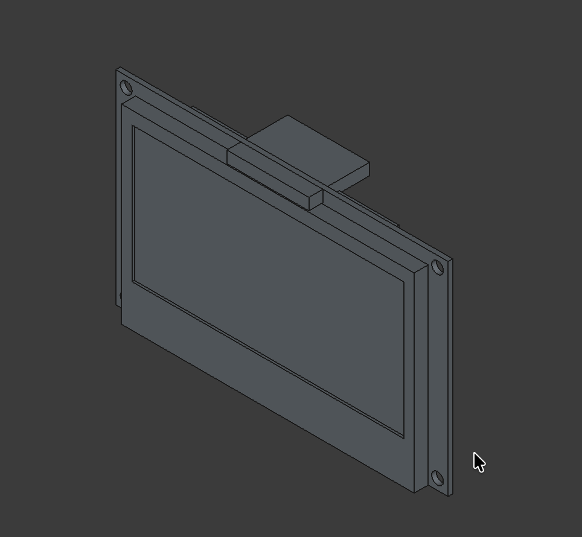
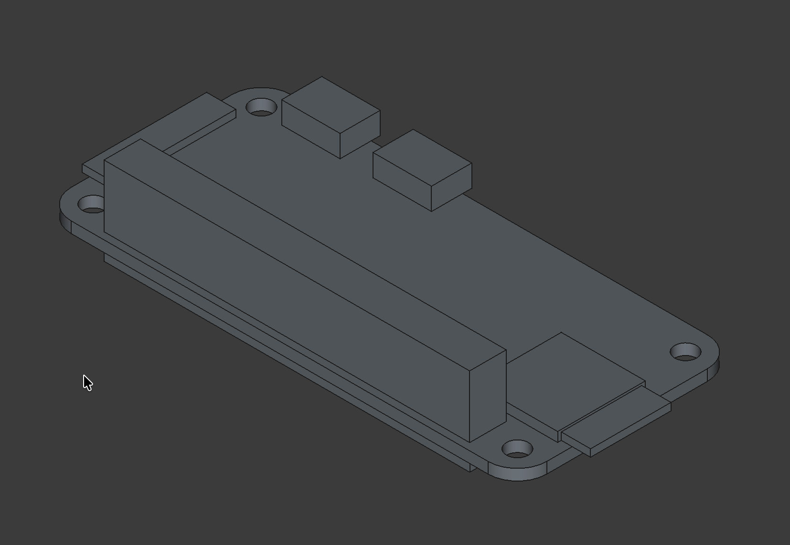

# cad parts

Parts I designed in [FreeCAD](https://www.freecad.org/) for various projects.

### Parts

#### OLED Display (SDD1309)

#### Raspberry Pi Zero W 2

#### Rotary Encoder KY-040

## License

All CAD files are licensed under the [MIT License](https://opensource.org/licenses/MIT).
